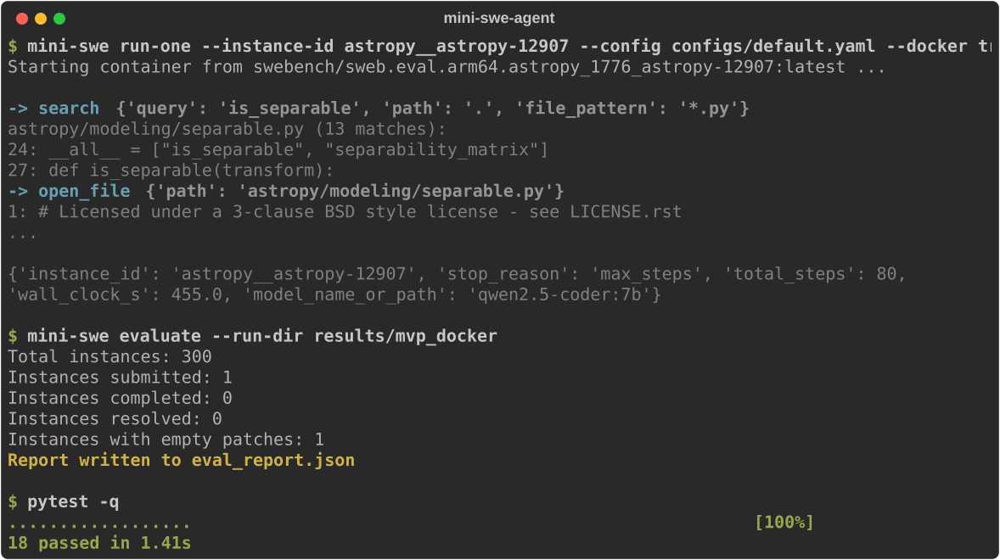

# mini-swe-agent

[](#development)
[](#prerequisites)
[](#prerequisites)
[](#license)

A small SWE-agent-style coding agent, evaluated on [SWE-bench Lite](https://www.swebench.com/), built to demonstrate SWE-agent's core insight: the **agent-computer interface (ACI)** — the tools an LLM is given (file viewer, search, edit commands) — matters as much as the model itself.

The agent reads a GitHub issue, explores a repository, edits code, runs tests, and submits a patch. Different ACI designs (a windowed/scrollable file viewer vs. a full-file dump, `ripgrep` vs. plain `grep`) are swapped via config and compared in an ablation study that reports fix-rate deltas — everything else held constant.

Runs entirely on a **local Ollama model** — no API keys, no cloud inference cost.

<p align="center">
  
</p>

<p align="center"><sub>Real output: the agent's <code>search</code>/<code>open_file</code> tool calls against <code>astropy__astropy-12907</code> inside its official SWE-bench Docker container, the official <code>swebench</code> scoring harness, and the test suite.</sub></p>

---

## Table of contents

- [Why this project](#why-this-project)
- [How it works](#how-it-works)
- [Status](#status)
- [Prerequisites](#prerequisites)
- [Setup](#setup)
- [Usage](#usage)
  - [Smoke test (no Docker)](#1-smoke-test-no-docker)
  - [5-instance scored dry run](#2-5-instance-scored-dry-run-docker)
  - [Ablation study](#3-ablation-study-does-the-aci-matter)
  - [Full SWE-bench Lite run](#4-full-swe-bench-lite-run-300-instances)
- [Project layout](#project-layout)
- [Development](#development)
- [Design notes](#design-notes)

## Why this project

SWE-agent's central finding was that giving an LLM a *raw shell* produces worse results than giving it a small, purpose-built toolset — a search command, a windowed file viewer, a guarded edit command. The tools are as much a design surface as the model choice.

This project reproduces that setup at a small scale: a real agentic loop, evaluated against real SWE-bench Lite instances inside their official Docker environments, with the tool implementations kept swappable so the ACI's effect on fix rate can actually be measured rather than asserted.

## How it works

```
GitHub issue
     │
     ▼
┌─────────────────────────────────────────────┐
│  Agent loop (mini_swe_agent/agent/loop.py)   │
│  observe → LLM call → tool call → observe    │
└─────────────────────────────────────────────┘
     │              ▲
     ▼ tool call     │ tool result
┌─────────────────────────────────────────────┐
│  ToolRegistry (tools/registry.py)            │
│  find_file · search · open_file · edit ·     │
│  run_tests · submit_patch                    │
└─────────────────────────────────────────────┘
     │
     ▼
┌─────────────────────────────────────────────┐
│  Executor: LocalRepoExecutor (dev-loop)      │
│         or DockerRepoExecutor (scored eval)  │
└─────────────────────────────────────────────┘
```

The agent loop never imports a concrete tool implementation — it only talks to the `ToolRegistry`, built at runtime from config (`tools.tool_profile: basic|windowed`, `tools.search_impl: grep|ripgrep`). That's the seam that makes the ablation study possible: swap the ACI, hold everything else constant, compare fix rates.

## Status

This is an active, in-progress research project, not a finished benchmark result. Honest state as of the last real run:

| Component | Status |
|---|---|
| Agent loop (Ollama tool-calling, prompted fallback, stop conditions) | ✅ Working, unit-tested |
| ACI tools (find/search/open/edit/test/submit), swappable per config | ✅ Working, unit-tested |
| Local dev-loop execution (no Docker) | ✅ Verified against a real SWE-bench issue |
| Docker + official `swebench` scoring pipeline | ✅ Verified end-to-end, real Docker builds, real tests, real scores |
| Ablation study (basic vs. windowed ACI) | ✅ Complete — see finding below |
| Agent fully resolving an issue | ⏳ Not yet observed — closest attempt passed 9/10 tests (see below) |
| Full 300-instance Lite run | ⏳ Not yet run |

**5-instance dev batch** (`qwen2.5-coder:7b`, 40-step budget): 0/4 resolved (1 instance excluded — can't build on Apple Silicon, a genuine `linux-aarch64` package-availability gap, not a bug). Every real run either exhausted its step budget without ever calling `edit`, or produced an edit that was rejected/wrong.

**Ablation study** (basic ACI: full-file dumps + grep vs. windowed ACI: scrollable viewer + ripgrep, same 4 instances): neither resolved anything (0/4 each), but **windowed ACI measurably changed agent behavior** — it advanced the model further into the intended workflow (reaching `edit` on an instance where basic ACI never got past searching) and converged ~2.5x faster on average (10.5 vs. 26.0 steps). That specific `edit` attempt was directionally correct but got rejected by the syntax guardrail because the model dropped the original line's indentation — a precise, fixable failure mode, not vague underperformance.

**Fixed the indentation bug and re-ran**: the same edit now succeeds on the first try, and the agent reaches `submit_patch` cleanly (10 steps, 34s) instead of cycling. Scored via the official harness: **9/10 tests passed**. The one failure (`TypeError: __init__() got an unexpected keyword argument 'header_rows'`) shows the real fix needs a new constructor parameter added across a reader/writer class — a multi-file API change the model's single-line edit didn't attempt. Close, not resolved — a genuine, specific, and honest research finding rather than a flat "it doesn't work."

A model-capability check (`qwen2.5-coder:14b`, confirmed fits in 16GB RAM) didn't help either: on the same instance where 7b made a no-op edit, 14b explored 40 tool calls and never attempted `edit` at all. Bigger model alone isn't the fix — this looks like a prompting/scaffolding ceiling as much as a raw-capability one.

## Prerequisites

1. **[Ollama](https://ollama.com)**, running locally, with a model pulled:
   ```bash
   ollama serve
   ollama pull qwen2.5-coder:7b
   ```
   > `qwen2.5-coder:32b` is supported via config but needs ~20GB+ RAM/VRAM —
   > confirmed to thrash and time out on a 16GB machine. Stick to `7b` unless
   > you have the memory to spare.

2. **[Docker Desktop](https://www.docker.com/products/docker-desktop/)**, running. Required for the official SWE-bench Lite evaluation harness — it starts each instance's official prebuilt container and runs tests inside it, which is what makes fix-rate numbers real and comparable.

3. **Python >= 3.10**.

## Setup

```bash
git clone <this-repo>
cd mini-swe-agent
python3 -m venv .venv && source .venv/bin/activate
pip install -e ".[dev]"
```

## Usage

### 1. Smoke test (no Docker)

Fastest way to check the agent loop itself, without touching Docker or official scoring:

```bash
mini-swe run-one --instance-id <some_instance_id> --config configs/default.yaml --docker false
```

Clones the instance's repo locally, runs the agent, prints the resulting patch. **Unscored** — for debugging agent behavior only.

### 2. 5-instance scored dry run (Docker)

```bash
# populate configs/subsets/dev5.txt with 5 real instance_ids
python -c "from mini_swe_agent.dataset.swebench_lite import load_instances; [print(i.instance_id) for i in load_instances(limit=5)]"

mini-swe run-batch --subset configs/subsets/dev5.txt --config configs/default.yaml --results-dir results/dev5
mini-swe evaluate --run-dir results/dev5
python scripts/report.py results/dev5
```

### 3. Ablation study: does the ACI matter?

Compares the "basic" ACI (full-file dumps, plain `grep`) against the "windowed" ACI (scrollable file viewer, `ripgrep`) on the same instances, everything else held constant:

```bash
mini-swe ablate --configs configs/ablation_basic_tools.yaml configs/ablation_windowed_tools.yaml --limit 10
python scripts/report.py results/ablation_basic_tools results/ablation_windowed_tools
```

Produces a Markdown comparison table — fix rate, resolved count, delta vs. baseline, avg steps, avg wall clock — the flagship result this project is built to produce.

### 4. Full SWE-bench Lite run (300 instances)

```bash
mini-swe run-batch --limit 300 --config configs/default.yaml --results-dir results/full_lite
mini-swe evaluate --run-dir results/full_lite
python scripts/report.py results/full_lite
```

Builds/pulls a Docker image per repo (cached after first use) and runs up to 300 local-LLM episodes — expect a long wall-clock run. `run-batch` is resumable: re-running the same command skips instances already completed in `results/full_lite/predictions.jsonl`.

### Swapping models

```bash
export MINI_SWE_MODEL=qwen2.5-coder:7b
mini-swe run-one --instance-id <id> --config configs/default.yaml --docker false
```

or edit `configs/default.yaml`'s `llm.model` directly.

## Project layout

```
mini_swe_agent/
├── config.py           RunConfig: defaults < YAML < env < CLI merge
├── llm/                 Ollama client + prompted tool-call fallback
├── tools/                find_file, search, open_file, edit, run_tests, submit_patch
│   └── registry.py       the ablation seam — binds tool names to implementations
├── agent/                loop, prompts, trajectory logging, stop conditions
├── env/                  LocalRepoExecutor (dev-loop) / DockerRepoExecutor (scored eval)
├── dataset/               SWE-bench Lite loader (HuggingFace)
├── harness/               single-instance run, batch runner, swebench scoring
└── ablation/              runs + scores multiple configs for comparison

scripts/report.py       fix-rate summary / cross-config comparison tables
tests/                   pytest unit tests (18, covering tools, parser, stopping, trajectory)
```

## Development

```bash
pytest -q
```

## Design notes

- **Why local Ollama, not an API model**: zero marginal cost per episode, which matters when running hundreds of agentic episodes across ablation configs and the full 300-instance Lite set.
- **Why the official `swebench` Docker harness, not a lightweight approximation**: fix-rate numbers are only meaningful if FAIL_TO_PASS/PASS_TO_PASS tests run in the exact environment SWE-bench defines. `DockerRepoExecutor` prefers pulling the official prebuilt per-instance image (`swebench/sweb.eval.<arch>.<instance_id>`) over building locally, which is both faster and more faithful.
- **Windowed file viewer over full-file dumps**: the single highest-value ACI choice this project replicates from SWE-agent — a scrollable, line-numbered cursor instead of dumping entire files, keeping context usage bounded regardless of file size.
- **Cycle-aware stop detection**: the agent loop detects not just immediately-repeated tool calls but longer alternating cycles (e.g. `search → open_file → search → open_file` on a hallucinated filename) — a real failure mode observed with small local models.

## License

MIT
